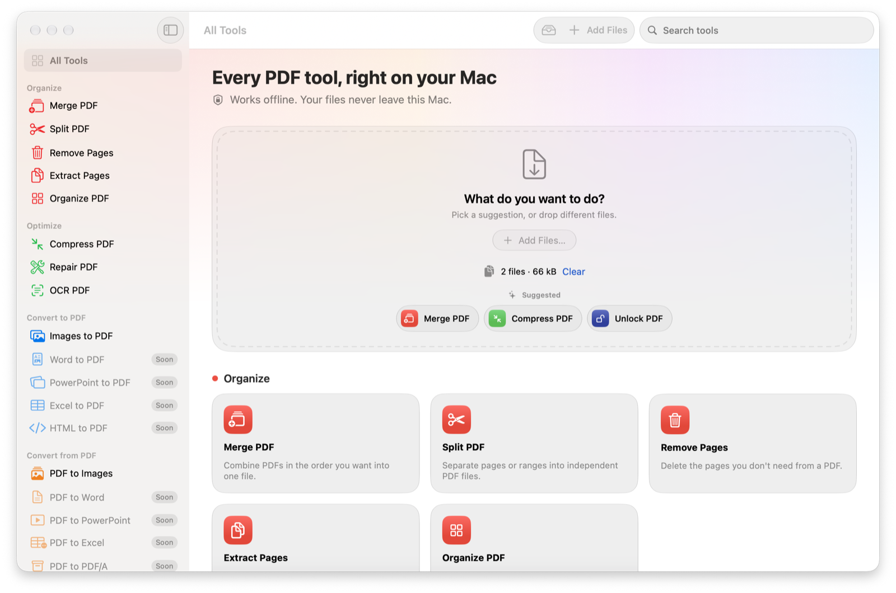
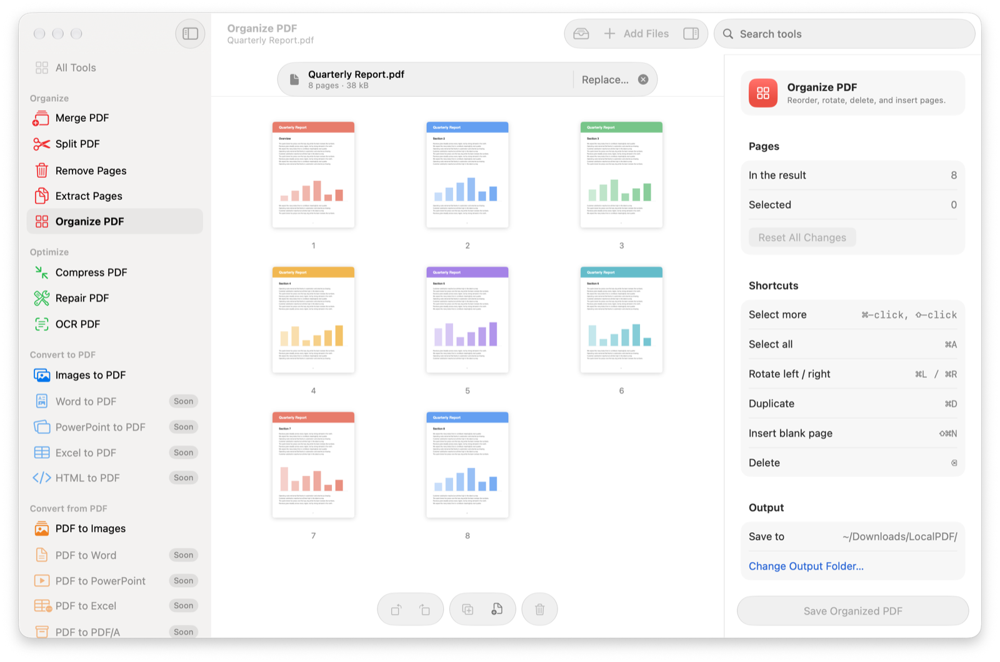
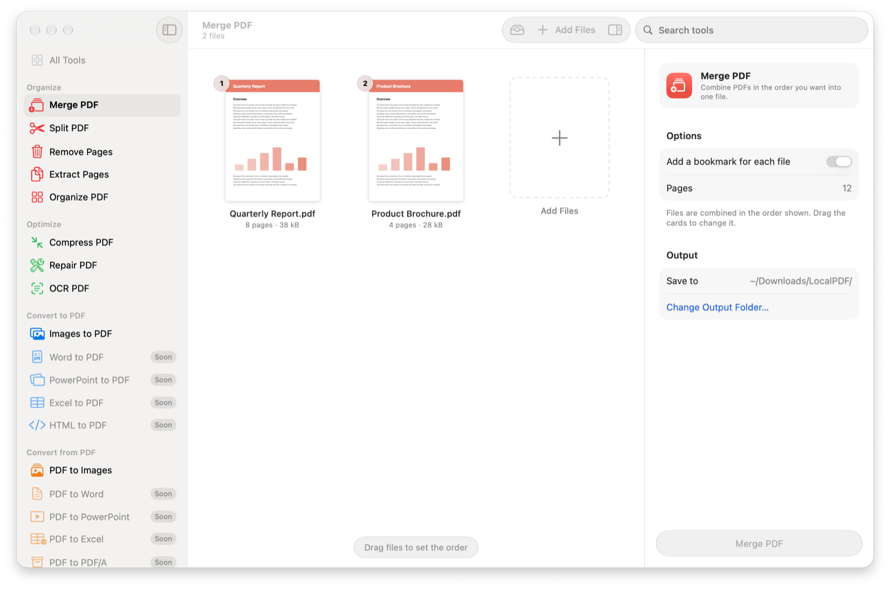

# LocalPDF

**Every PDF tool, right on your Mac.** LocalPDF is a free, open-source PDF toolkit for
macOS: merge, split, compress, OCR, protect, unlock and more. It does what web services like
iLovePDF do, except your files never leave your computer.



## Why LocalPDF

- **Private by construction.** The app is sandboxed and ships **without the network
  entitlement**, so macOS itself stops it from connecting to the internet. Nothing is
  uploaded, because it can't be. ([Check it yourself](#verify-the-privacy-claim).)
- **Native.** Built in Swift and SwiftUI for macOS 27, in the Liquid Glass design. It
  launches instantly, follows Dark Mode and accessibility settings, and works with the
  keyboard.
- **Works offline.** On a plane, behind a firewall, or with confidential documents.
- **Free and open source** under the [MIT License](LICENSE).

## Tools

16 tools work today. The others show as "Soon" in the app.

| | Available now | Coming |
|---|---|---|
| **Organize** | Merge · Split · Remove Pages · Extract Pages · Organize (reorder, rotate, duplicate, insert blank pages) | |
| **Optimize** | Compress (three levels) · Repair · OCR (make scans searchable) | |
| **Convert to PDF** | Images to PDF (JPG, PNG, HEIC, TIFF, WebP…) | Word · PowerPoint · Excel · HTML |
| **Convert from PDF** | PDF to Images (render pages or extract embedded images) | Word · PowerPoint · Excel · PDF/A · Markdown |
| **Edit** | Rotate · Page Numbers · Watermark (text or image) · Crop | Edit (annotations) · Forms |
| **Security** | Protect (AES-256) · Unlock | Sign · Redact · Compare |
| **Intelligence** (on-device) | | Summarize · Translate |

Also:

- **Smart suggestions:** drop files on the home screen and LocalPDF suggests the right tool
  (OCR for scans, Unlock for protected files, Merge for several PDFs…).
- **Page grid:** click pages to build ranges, drag to reorder, right-click or press Space to
  preview a page large.
- **Continue with…:** feed one tool's result straight into the next, e.g. Merge →
  Compress → Protect.
- **Finder Quick Actions:** right-click PDFs in Finder and choose *Compress with LocalPDF*,
  *Merge with LocalPDF* and more.
- **Batch processing:** most tools take many files at once, with a job queue you can cancel.
- **Predictable output:** results go to `~/Downloads/LocalPDF/` (or a folder you choose) as
  `localpdf_<action>_<original name>.pdf`. Originals are never modified.

<p align="center">
  
  
</p>

## Requirements

- **macOS 27** or later (Apple silicon).
- To build: **Xcode 27** and [XcodeGen](https://github.com/yonaskolb/XcodeGen)
  (`brew install xcodegen`).

## Install

There is no signed download yet; it's planned. Until then, build it from source in about a
minute:

```bash
git clone https://github.com/gielfull/LocalPDF.git
cd LocalPDF
xcodegen generate
xcodebuild -project LocalPDF.xcodeproj -scheme LocalPDF -configuration Release \
  -destination 'platform=macOS' -derivedDataPath build \
  CODE_SIGN_IDENTITY=- DEVELOPMENT_TEAM= build
cp -R build/Build/Products/Release/LocalPDF.app /Applications/
```

`CODE_SIGN_IDENTITY=- DEVELOPMENT_TEAM=` signs the app ad hoc, so you don't need an Apple
developer account to run it on your own Mac. Finder Quick Actions appear once the app is in
`/Applications` and has been opened once (log out and back in if they don't show up).

## Verify the privacy claim

The entitlements are the permissions macOS enforces on a sandboxed app. Print them:

```bash
codesign -d --entitlements - /Applications/LocalPDF.app
```

You'll see the App Sandbox plus access to files you pick and to your Downloads folder,
and **no** `com.apple.security.network.client` or `.server`. Without those, the sandbox
blocks every network connection the app could try to make.

## How it works

LocalPDF is a SwiftUI app on top of **PDFEngine**, a local Swift package that holds every tool
and has no UI code. Each tool is one `PDFOperation` with a `Codable` `Options` value, so the
same tool can later run from Shortcuts, saved workflows and a command-line tool.

The engine uses Apple's frameworks: PDFKit and Core Graphics for pages, Vision for OCR,
ImageIO for images. [qpdf](https://github.com/qpdf/qpdf) handles the low-level work
(repair, AES-256 encryption, structural compression). It is compiled from source inside
the package; see [`THIRD_PARTY_NOTICES.md`](THIRD_PARTY_NOTICES.md).

For the project layout, build and test commands, see [`CONTRIBUTING.md`](CONTRIBUTING.md).

## Contributing

Contributions are welcome. Read [`CONTRIBUTING.md`](CONTRIBUTING.md) to get set up. Please
follow the [Code of Conduct](CODE_OF_CONDUCT.md), and report security issues privately as
described in [`SECURITY.md`](SECURITY.md).

**Please don't attach confidential PDFs to issues.** If a bug needs a sample file, make a
harmless one that reproduces it.

## License

LocalPDF is released under the [MIT License](LICENSE). It includes qpdf (Apache-2.0) and the
Independent JPEG Group's libjpeg; their notices are in
[`THIRD_PARTY_NOTICES.md`](THIRD_PARTY_NOTICES.md).

LocalPDF is an independent project. It is not affiliated with or endorsed by iLovePDF or
Adobe. "PDF" is used descriptively.
